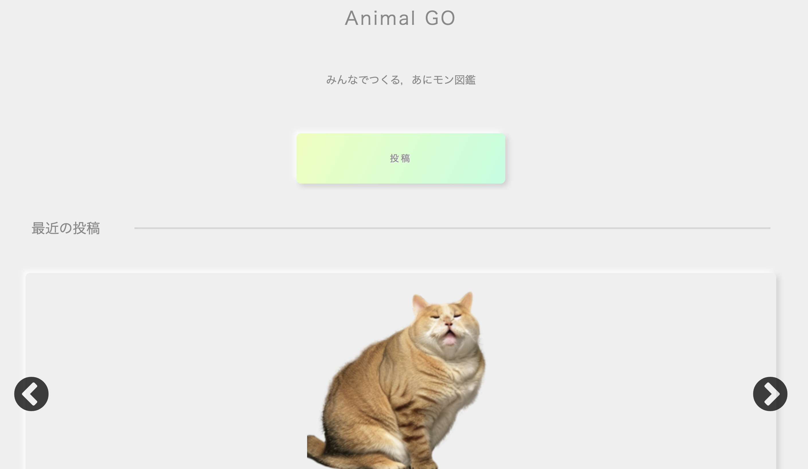
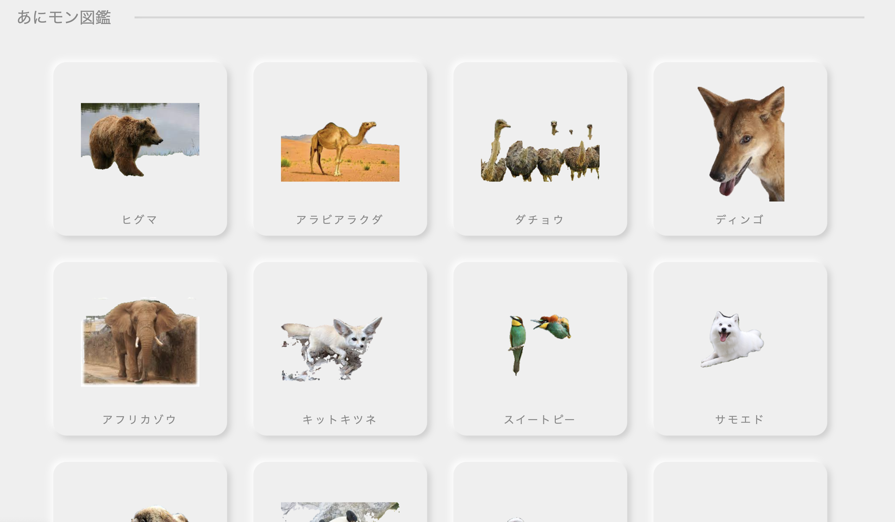
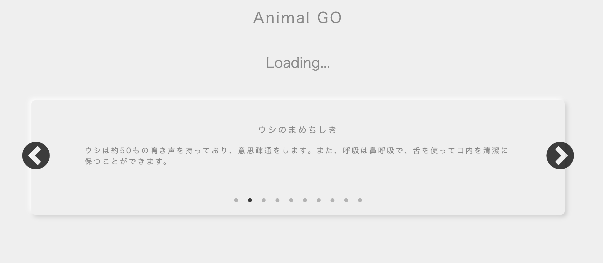
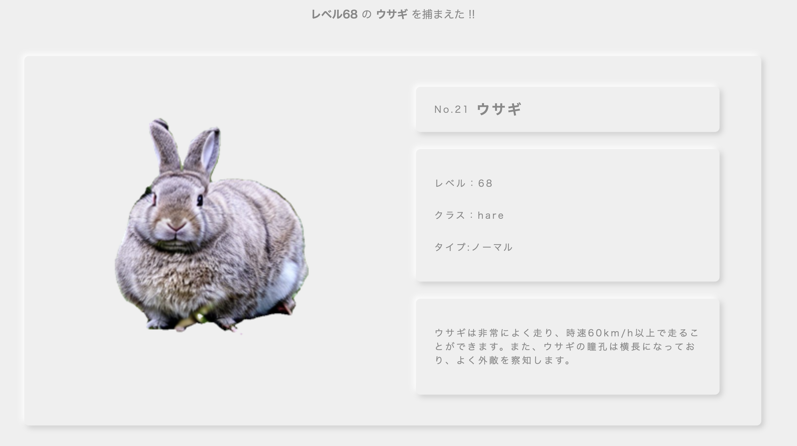
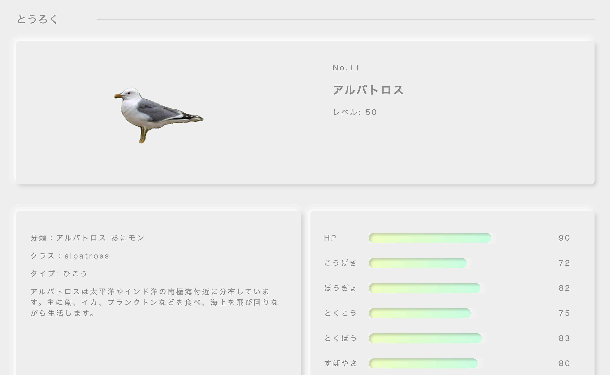
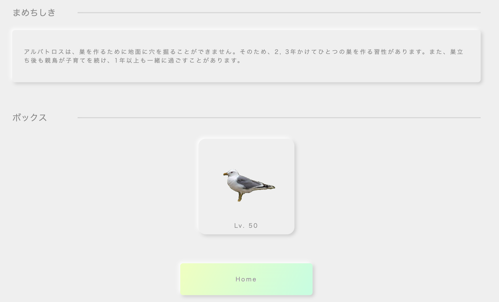

# Animal GO (Advance)

**Backend**

**Frontend**

**API**

**Development**

<!-- ### 使いたい技術
- Docker, Github Actions
- DRF + React(TypeScript), AWS -->

---

| url | page |
| - | - |
| / | ホーム画面 |
| /detail/(id) | 詳細画面 |
| /loading | ロード画面 |
| /result | 生成結果 |

---

**Animal GO URL**
[Animal GO](http://animalgo-advanc.com)

**ホーム画面**

**ロード画面**

**リザルト画面**

**詳細画面**

**Canva**
[スライドページ](https://www.canva.com/design/DAFmniET5x0/J4Z1fpjKZrqM0rfMmCN9Yw/edit?utm_content=DAFmniET5x0&utm_campaign=designshare&utm_medium=link2&utm_source=sharebutton)